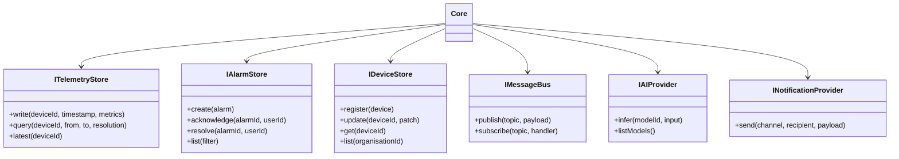

# Core

## Definition

The Core is the central authority of the LavinIoT platform. It owns the canonical data model, enforces all business rules, and coordinates all platform modules. It contains no integration logic, protocol adapters, or presentation concerns.

**The Core knows only interfaces.** It depends on no specific provider implementation. A database, message broker, protocol adapter, or storage provider can be replaced without modifying Core logic.

---

## Core interface catalogue

---

## Core event bus

All inter-module communication is mediated by the Core event bus. Modules do not call each other directly.

| Event | Producer | Consumers |
|---|---|---|
| `telemetry.received` | Integration Bus | Alarm Manager, AI Engine |
| `alarm.triggered` | Alarm Manager | Notification Manager |
| `alarm.acknowledged` | API layer | Audit Log |
| `device.connected` | Protocol Gateway | Device Manager |
| `device.disconnected` | Protocol Gateway | Alarm Manager, Device Manager |
| `inference.result` | AI Engine | Alarm Manager |

---

## What the Core does NOT do

| Excluded concern | Where it belongs |
|---|---|
| Protocol parsing (OPC-UA, Modbus) | Protocol Providers |
| HTTP request handling | API layer |
| Rendering / UI state | Presentation layer |
| Time-series database internals | Telemetry Store Provider |
| AI model training | External ML pipeline |
| Email / SMS internals | Notification Provider |
