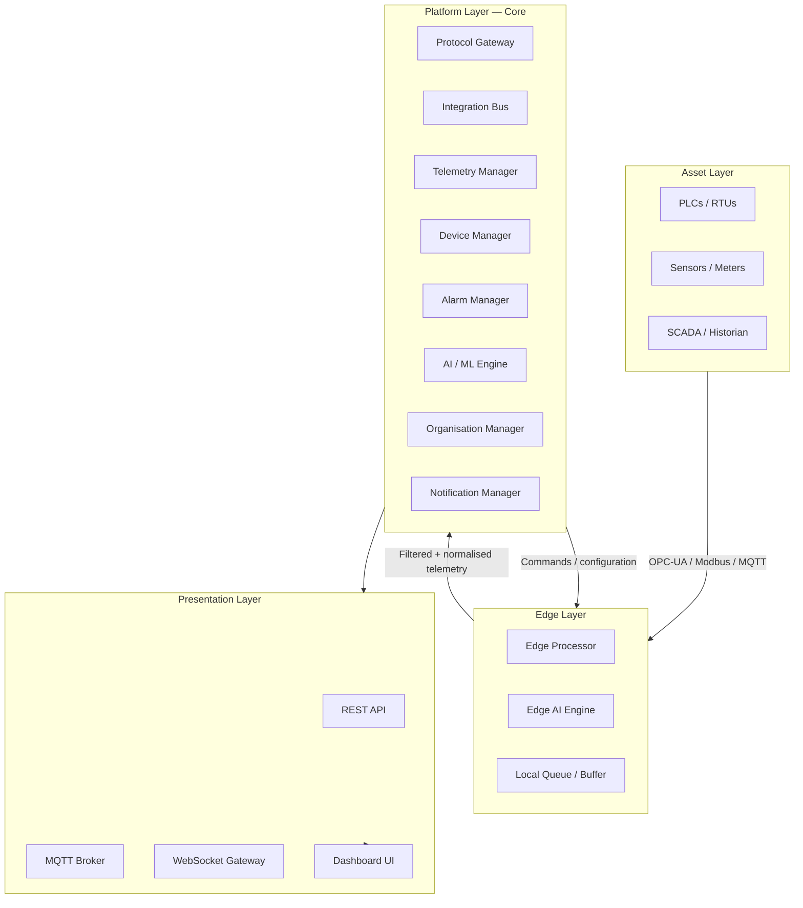

# Platform Topology

## Four-layer architecture

---

## Layer responsibilities

### Asset Layer
Physical devices and existing control infrastructure. LavinIoT does not control this layer — it reads from it, and where permitted, writes back to it. This layer is owned by the customer.

### Edge Layer
- **Edge Processor** — receives raw protocol data, normalises it, applies local filtering rules
- **Edge AI Engine** — runs ONNX inference models locally for time-critical decisions that cannot wait for a cloud round-trip
- **Local Queue** — buffers telemetry during connectivity loss; synchronises in order when connection is restored

### Platform Layer (Core)
The authoritative system of record for all platform state. Owns: device registry, telemetry routing and storage, alarm evaluation, organisation hierarchy, AI orchestration, notification dispatch, and the audit log. See [Core](./core).

### Presentation Layer
Stateless interface adapters. The REST API, MQTT broker, and WebSocket gateway serve external consumers. The Dashboard UI is one consumer of the REST API — it has no privileged access.

---

## Inter-layer communication rules

| From → To | Protocol | Direction |
|---|---|---|
| Asset → Edge | OPC-UA, Modbus, MQTT | Push / Poll |
| Edge → Core | MQTT / REST | Push (telemetry), Pull (config) |
| Core → Edge | MQTT | Push (commands) |
| Core → Presentation | Internal | On request / event |
| Presentation → Core | Internal service call | Request |
| UI → API | HTTPS REST + WebSocket | Request / Subscribe |
