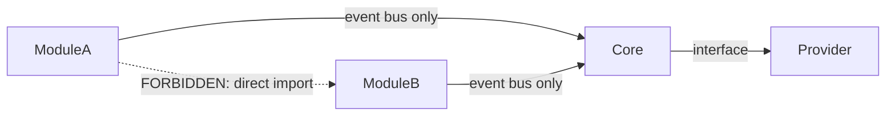

<p class="section-meta">Section 03</p>

# Module Catalog

> Every discrete platform capability is a Module. This section is the authoritative reference for every module in the platform — what it does, what it depends on, and how it communicates.

---

## Purpose of this section

Before implementing any new capability, the module must be defined here. A module definition includes its ID, purpose, dependencies, events it produces, and events it consumes. Implementation begins only after the module definition is complete.

---

## Module isolation rules



- Modules communicate through the Core event bus only
- Modules do not import each other
- Modules do not call provider interfaces directly — only the Core does

---

## Module catalogue

| Module | ID | Status |
|---|---|---|
| [Telemetry Manager](./telemetry-manager) | `telemetry-manager` | Planned |
| [Alarm Manager](./alarm-manager) | `alarm-manager` | Planned |
| [Device Manager](./device-manager) | `device-manager` | Planned |
| [AI Engine](./ai-engine) | `ai-engine` | Planned |
| [Notification Manager](./notification-manager) | `notification-manager` | Planned |
| [Integration Bus](./integration-bus) | `integration-bus` | Planned |
| [Organisation Manager](./organisation-manager) | `organisation-manager` | Planned |

---

## Module contract

Every module must implement:

```
IModule {
  id: string              // unique, stable identifier
  version: string         // semver
  dependencies: string[]  // Core interfaces required
  onStart(): void
  onStop(): void
  onEvent(event: CoreEvent): void
}
```

The Core verifies all declared dependencies are satisfied before a module is allowed to start.
