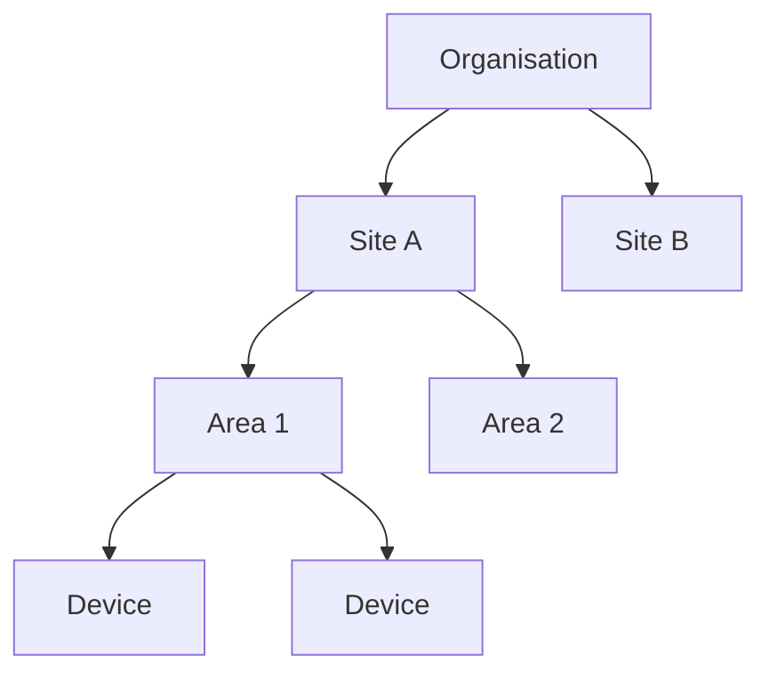

# Organisation Manager

| Field | Value |
|---|---|
| **Module ID** | `organisation-manager` |
| **Status** | Planned |
| **Dependencies** | `IDeviceStore`, `IMessageBus` |

## Purpose

Manages the tenant hierarchy: Organisation → Site → Area → Device. Enforces data isolation boundaries. Manages user accounts and role assignments within the organisation scope.

## Hierarchy

## Events produced

| Event | Consumers |
|---|---|
| `organisation.created` | Audit Log |
| `user.invited` | Notification Manager |
| `user.role.updated` | Audit Log |
