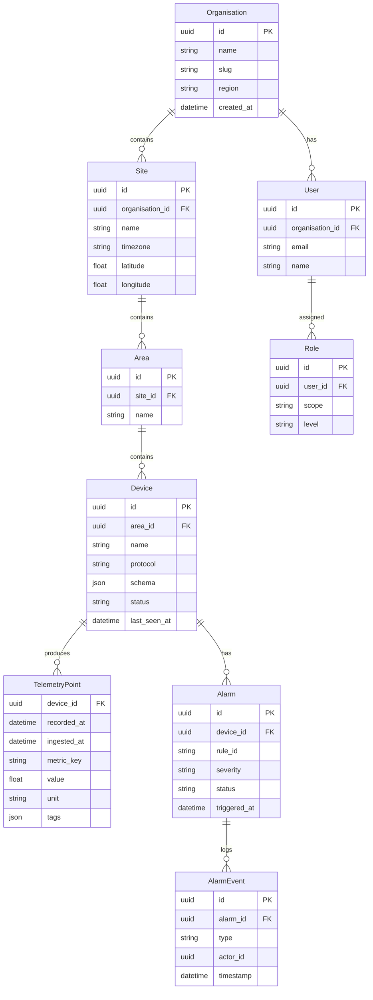

# Entities

## Entity relationship diagram

```mermaid
erDiagram
    Organisation ||--o{ Site : contains
    Site ||--o{ Area : contains
    Area ||--o{ Device : contains
    Device ||--o{ TelemetryPoint : produces
    Device ||--o{ Alarm : has
    Organisation ||--o{ User : has
    User ||--o{ Role : assigned
    Alarm ||--o{ AlarmEvent : logs

    Organisation {
        uuid id PK
        string name
        string slug
        string region
        datetime created_at
    }
    Site {
        uuid id PK
        uuid organisation_id FK
        string name
        string timezone
        float latitude
        float longitude
    }
    Area {
        uuid id PK
        uuid site_id FK
        string name
    }
    Device {
        uuid id PK
        uuid area_id FK
        string name
        string protocol
        json schema
        string status
        datetime last_seen_at
    }
    TelemetryPoint {
        uuid device_id FK
        datetime recorded_at
        datetime ingested_at
        string metric_key
        float value
        string unit
        json tags
    }
    Alarm {
        uuid id PK
        uuid device_id FK
        string rule_id
        string severity
        string status
        datetime triggered_at
    }
    AlarmEvent {
        uuid id PK
        uuid alarm_id FK
        string type
        uuid actor_id
        datetime timestamp
    }
    User {
        uuid id PK
        uuid organisation_id FK
        string email
        string name
    }
    Role {
        uuid id PK
        uuid user_id FK
        string scope
        string level
    }
```
