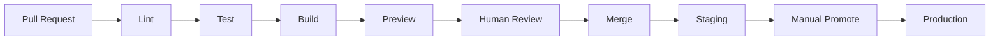

# CI / CD

## Pipeline principles

- Every pull request runs the full test suite before merge
- No code reaches production without passing CI
- Deployments are automated — no manual steps for standard releases
- Rollback is automated and tested before a deployment is considered stable

## Repository pipeline map

| Repository | CI | Deployment |
|---|---|---|
| `laviniot-website` | GitHub Actions | Vercel (automatic) |
| `laviniot-platform` | GitHub Actions | Vercel + VPS |
| `laviniot-architecture` | GitHub Actions | TBD |

## Pipeline stages

## Environment promotion

| Environment | Trigger |
|---|---|
| Preview | Every PR |
| Staging | Merge to `main` |
| Production | Manual promotion or version tag |
