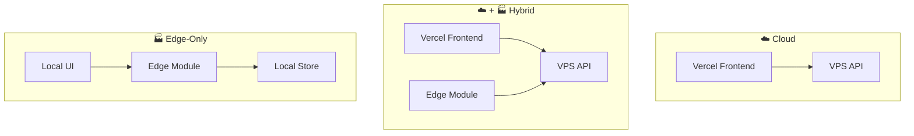

# Deployment Models

## Three models

## Model selection guide

| Requirement | Recommended model |
|---|---|
| Cloud connectivity always available | Cloud |
| Intermittent connectivity, cloud preferred | Hybrid |
| Air-gapped or strict data residency | Edge-Only |
| Time-critical local decisions + cloud reporting | Hybrid |
