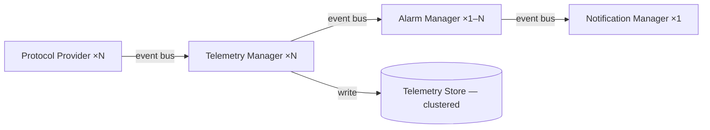

# ADR-0001: The platform shall be modular

| Field | Value |
|---|---|
| **Status** | ✅ Accepted |
| **Date** | 2025-01-01 |
| **Author** | Chief Software Architect |
| **Supersedes** | N/A |
| **Superseded by** | N/A |

---

## Context

LavinIoT must support multiple industrial protocols, multiple storage backends, multiple AI inference environments, multiple notification channels, and multiple deployment models. At the time of this decision, no provider had been selected as permanent. Customer requirements and vendor landscapes were expected to change over the platform's operational lifetime.

The question: should the platform be built as a tightly integrated monolith, or as independently replaceable components connected through defined interfaces?

---

## Decision

**The LavinIoT platform shall be modular.**

Modularity is defined as:

1. **The Core knows only interfaces.** The Core defines typed interfaces for every external capability. It never depends on a concrete implementation.
2. **Providers implement interfaces.** A Provider encapsulates all knowledge of a specific technology behind the interface boundary. The Core cannot tell which Provider is active.
3. **Providers are replaceable by configuration.** Switching providers requires only configuration change and Provider code — not Core or Module changes.
4. **Modules are discrete capability units.** Functional areas (Alarm Manager, Telemetry Manager, AI Engine) are registered with the Core at startup and do not import each other.
5. **Modules communicate through the Core event bus.** Direct method calls between Modules are prohibited.
6. **Scalability is a first-class design goal.** Module and provider boundaries are drawn such that any component can be scaled independently.

---

## Why modularity is required

### The vendor landscape changes

Industrial IoT technology evolves. Time-series databases that are optimal today may be superseded. AI inference hardware is advancing rapidly. Protocol standards are consolidated. A platform tightly coupled to specific vendors requires expensive rewrites as the landscape evolves. Modularity means adopting a new technology is a Provider implementation task — not a platform rewrite.

### Customer requirements are heterogeneous

Different customers have different requirements. Customer A needs EU-hosted self-managed storage. Customer B tolerates cloud storage. Customer C operates air-gapped. A modular platform deploys only the Providers relevant to each environment.

### The Core must be testable in isolation

If the Core contains direct dependencies on databases and external APIs, testing requires all those systems to be running. When the Core depends only on interfaces, they are replaced with in-memory mocks during testing. Business logic is tested in milliseconds without external dependencies.

### Teams can work in parallel

When boundaries are defined by interfaces, different engineers can develop the Core, Modules, and Providers concurrently. The interface is the contract. Each side can be developed, tested, and deployed independently.

---

## Why the Core only knows interfaces

The Core is the authoritative business logic of the platform. If the Core knew about InfluxDB, it would need to change when the database is replaced. By restricting the Core to interfaces only, we achieve dependency inversion: the high-level policy (Core) does not depend on the low-level mechanism (Provider). The Provider depends on the interface that the Core defines.

**Result:** The Core is stable, testable, and portable. Provider changes have zero impact on Core code.

---

## Why providers must be replaceable

A Provider that cannot be replaced is a hardcoded dependency. Replaceability is enforced by three rules:

1. The interface is the only public API. All Provider internals are hidden.
2. Providers carry no business logic. Business logic belongs in the Core or Module.
3. Provider selection is configuration, not code. Changing the database is a configuration change and Provider deployment — not a Core code change.

**Operational consequence:** Replacing InfluxDB with TimescaleDB requires writing a `TimescaleDBTelemetryStoreProvider`, updating configuration, and deploying. No other code changes.

---

## Why scalability is a first-class design goal

Industrial IoT systems experience uneven load. Telemetry ingestion spikes differ from alarm evaluation throughput. If these run in the same process with shared memory, scaling one requires scaling the other. Modules that communicate through a message bus scale independently.

The modular design establishes clear scaling boundaries:

Each component scales horizontally without modifying adjacent components. The initial deployment runs a single replica — the architecture permits scaling without redesign.

---

## Consequences

### Positive
- Technology decisions are deferrable
- Core is testable without external dependencies
- Providers and Modules can be developed in parallel
- New customer environments are served by composing existing Modules and Providers differently

### Negative
- Higher upfront design cost — interfaces must be defined before implementation
- Increased abstraction — new contributors must understand the boundary pattern
- Interface design errors are expensive to fix after Providers are implemented

### Neutral
- Initial single-server deployment will not use horizontal scaling — it becomes relevant as the platform grows

---

## Alternatives considered

### Monolithic architecture
All integrations in the same codebase with direct calls. **Rejected:** technology lock-in, testing requires all external systems, cannot scale independently.

### Microservices from day one
Each Module as an independent service. **Rejected:** network overhead, operational burden, and distributed system complexity are not justified at current team size and scale. The modular design preserves the option to extract Modules into services later.

### Plugin architecture
Dynamic plugin loading at runtime. **Rejected:** adds startup complexity and versioning challenges not warranted by the benefit over static configuration-driven selection.
