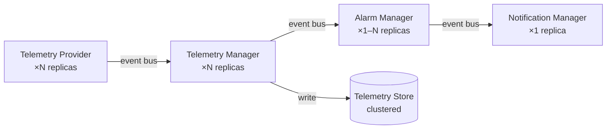

# ADR-0001: The platform shall be modular

| Field | Value |
|---|---|
| **Status** | ✅ Accepted |
| **Date** | 2025-01-01 |
| **Author** | Chief Software Architect |
| **Supersedes** | N/A |
| **Superseded by** | N/A |

---

## Context

LavinIoT is an Industrial IoT platform that must support:

- Multiple industrial protocols (OPC-UA, Modbus, MQTT, REST)
- Multiple time-series storage backends (InfluxDB, TimescaleDB)
- Multiple AI inference environments (local ONNX, cloud ML services)
- Multiple notification channels (email, SMS, webhook, push)
- Multiple deployment models (cloud, edge, hybrid)
- Multiple customer environments with different compliance and data residency requirements

At the time this decision was made, the platform was in early design. No protocol, database, or AI provider had been selected as permanent. Customer requirements and vendor landscapes were expected to change over the operational lifetime of the platform.

The question before the architects was:

> Should the platform be built as a tightly integrated monolith, or as a collection of independently replaceable components connected by defined interfaces?

A tightly integrated approach would be faster to build initially. A modular approach would impose upfront design cost but preserve the ability to adapt as requirements evolve.

---

## Decision

**The LavinIoT platform shall be modular.**

Modularity is defined as:

1. **The Core knows only interfaces.** The platform Core defines typed interfaces for every external capability (telemetry storage, messaging, AI inference, notifications, protocol adapters). It never depends on a concrete implementation.

2. **Providers implement interfaces.** Concrete implementations of each Core interface are called Providers. A Provider encapsulates all knowledge of a specific technology (InfluxDB, MQTT, OPC-UA) behind the interface boundary. The Core cannot tell which Provider is active.

3. **Providers are replaceable by configuration.** Switching from one Provider to another must not require any change to Core or Module code. It requires only configuration change and Provider code.

4. **Modules are discrete capability units.** Functional areas of the platform (Alarm Manager, Telemetry Manager, AI Engine, Notification Manager) are implemented as Modules. Modules are registered with the Core at startup. Modules do not import each other directly.

5. **Modules communicate through the Core event bus.** All inter-module communication is mediated by a typed event bus exposed by the Core. Direct method calls between Modules are prohibited.

6. **Scalability is a first-class design goal.** The module and provider boundaries are drawn such that any component can be scaled independently. A telemetry ingestion surge should not require scaling the alarm evaluation engine.

---

## Why modularity is required

### 1. The vendor landscape changes

Industrial IoT technology evolves. Time-series databases that are optimal today may be superseded. AI inference hardware for the edge is advancing rapidly. Protocol standards are consolidated by industry consortia. A platform that is tightly coupled to specific vendors will require expensive rewrites as the landscape evolves.

Modularity ensures that adopting a new technology is a Provider implementation task — not a platform rewrite.

### 2. Customer requirements are heterogeneous

Different customers have different requirements:

- Customer A is in Germany and requires data to remain on EU servers using a self-hosted database
- Customer B is in a connected factory and tolerates cloud storage
- Customer C operates in an air-gapped facility and needs full edge deployment

A monolithic platform cannot serve all three without carrying every possible implementation simultaneously. A modular platform deploys only the Providers relevant to each customer's environment.

### 3. The Core must be testable in isolation

If the Core contains direct dependencies on databases, message brokers, and external APIs, testing the Core requires all of those systems to be running. This creates fragile, slow, and environment-dependent tests.

When the Core depends only on interfaces, the interfaces can be replaced with in-memory mocks during testing. Core business logic (alarm evaluation, telemetry routing, organisation enforcement) can be tested in milliseconds without any external dependencies.

### 4. Teams can work in parallel

When boundaries are defined by interfaces, different engineers or teams can develop the Core, Modules, and Providers concurrently. The interface is the contract. Each side of the interface can be developed, tested, and deployed independently.

---

## Why the Core only knows interfaces

The Core is the authoritative business logic of the platform. It decides when an alarm is triggered. It enforces tenant isolation. It validates incoming telemetry. It routes events between modules.

If the Core knew about InfluxDB, it would need to be changed when the database is replaced. If the Core knew about MQTT, it would break when a different message broker was selected. Every direct dependency in the Core is a future constraint on the platform's ability to evolve.

By restricting the Core to interfaces only, we achieve a property called **dependency inversion**: the high-level policy (Core) does not depend on the low-level mechanism (Provider). The Provider depends on the interface that the Core defines.

This means:

- The Core is stable. Provider changes have zero impact on Core code.
- The Core is testable. Providers are replaced with mocks in tests.
- The Core is portable. It can run with any compliant Provider set.

---

## Why providers must be replaceable

A Provider that cannot be replaced is not a Provider — it is a hardcoded dependency.

Replaceability is enforced by three rules:

1. **The interface is the only public API.** A Provider may have internal structure, connection pooling, caching, retry logic — but all of that is internal. The Core calls one interface, and only the interface.

2. **Providers carry no business logic.** If a Provider makes a business decision, that decision becomes invisible to the Core and untestable through Core tests. Business logic belongs in the Core or the relevant Module.

3. **Provider selection is configuration, not code.** The platform reads a configuration value at startup to select which Provider class to instantiate. Changing the database is a configuration change and a Provider deployment — not a code change in the Core.

The operational consequence: replacing InfluxDB with TimescaleDB requires writing a `TimescaleDBTelemetryStoreProvider` that implements `ITelemetryStore`, updating the configuration, and deploying. No other code changes.

---

## Why scalability is a first-class design goal

Industrial IoT systems experience uneven load. Telemetry ingestion during a shift change may spike by an order of magnitude. Alarm evaluation and notification delivery have different throughput characteristics than storage.

If telemetry ingestion and alarm evaluation run in the same process with shared memory, scaling one requires scaling the other. Modules that communicate through a message bus can be scaled independently.

The modular design establishes clear scaling boundaries:

Each component can scale horizontally without modifying adjacent components. The event bus absorbs traffic spikes between stages.

This does not mean the initial deployment must run multiple replicas. It means the architecture permits scaling without redesign when the need arises.

---

## Consequences

### Positive

- Technology decisions are deferrable — the best database for production does not need to be selected before the Core is built
- Core business logic is testable without external dependencies
- Providers can be developed, tested, and deployed by different team members simultaneously
- A new customer environment can be served by composing existing Modules and Providers differently
- The platform can evolve as the industrial IoT landscape evolves without rewriting Core logic

### Negative

- Higher upfront design cost — interfaces must be defined before implementation begins
- Increased abstraction — new contributors must understand the interface boundary pattern before contributing Providers
- Interface design errors are expensive to fix after Providers are implemented

### Neutral

- The initial single-server deployment will not use the scaling features of the modular design — they become relevant as the platform grows
- The event bus adds a layer of indirection that must be understood when debugging cross-module flows

---

## Alternatives considered

### Monolithic architecture

Build the platform as a single, integrated application where the Core, Modules, and external integrations are in the same codebase with direct method calls.

**Rejected because:**
- Technology lock-in: Replacing a database or AI provider would require changes across the codebase
- Testing requires all external systems to be running
- Cannot scale components independently
- Heterogeneous customer requirements cannot be served without maintaining every integration simultaneously

### Microservices from day one

Build each Module as an independent service from the start, communicating over a network.

**Rejected because:**
- Network overhead between services adds latency and operational complexity at a stage where the platform is not yet at the scale that justifies it
- Operational burden (service discovery, distributed tracing, independent deployments) is too high for the current team size
- The modular architecture preserves the option to extract Modules into services later, without making it a requirement now

### Plugin architecture

Use a dynamic plugin system where Providers are loaded as plugins at runtime.

**Rejected because:**
- Runtime plugin loading adds complexity to the startup sequence and error handling
- Static configuration-driven Provider selection achieves the same goal with less complexity
- Dynamic plugins create versioning challenges that are not necessary at this stage
