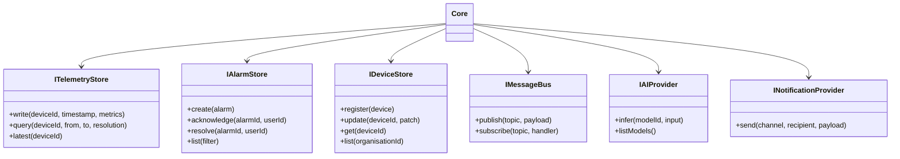
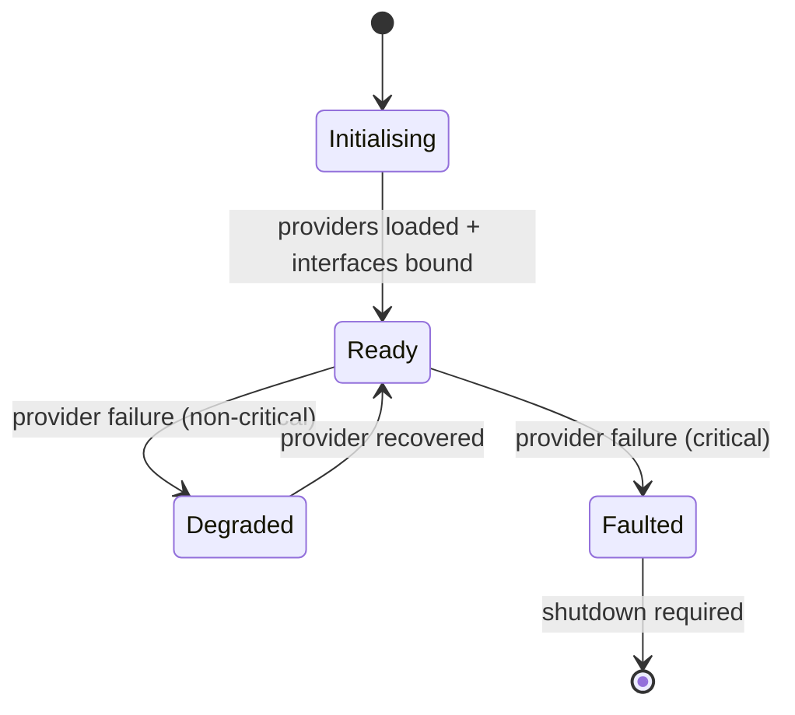

# Core

## Definition

The Core is the central authority of the LavinIoT platform. It owns the canonical data model, enforces all business rules, and coordinates all platform modules. It does not contain integration logic, protocol adapters, or presentation concerns.

**The Core knows only interfaces.** It depends on no specific provider implementation. A database, a message queue, a protocol adapter, or a storage provider can be replaced without modifying Core logic.

---

## Responsibilities

| Responsibility | Description |
|---|---|
| **Device Registry** | Maintains the authoritative record of all connected devices, their configuration, and their status |
| **Telemetry ingestion** | Accepts normalised telemetry events from the Integration Bus and routes them to storage |
| **Alarm evaluation** | Evaluates alarm rules against incoming telemetry and emits alarm events |
| **Organisation management** | Manages the hierarchy of tenants, organisations, sites, and users |
| **AI orchestration** | Invokes AI/ML inference through a defined AI Provider interface |
| **Event bus** | Provides a typed event bus through which modules communicate without direct coupling |
| **Audit log** | Records all write operations with actor, timestamp, and payload |

---

## Core interfaces

The Core defines the following provider interfaces. Each interface has exactly one active implementation at runtime, selected by configuration.

---

## What the Core does NOT do

| Excluded concern | Where it belongs |
|---|---|
| Protocol parsing (OPC-UA, Modbus) | Protocol Providers |
| HTTP request handling | API layer |
| Rendering / UI state | Presentation layer |
| Time-series database internals | Telemetry Store Provider |
| AI model training | External ML pipeline |
| Email / SMS sending internals | Notification Provider |

---

## Core event bus

All inter-module communication goes through the event bus. Events are typed, versioned, and documented here as they are introduced.

| Event | Producer | Consumers |
|---|---|---|
| `telemetry.received` | Integration Bus | Alarm Manager, AI Engine |
| `alarm.triggered` | Alarm Manager | Notification Provider |
| `alarm.acknowledged` | API layer | Audit Log |
| `device.connected` | Protocol Gateway | Device Manager |
| `device.disconnected` | Protocol Gateway | Alarm Manager, Device Manager |

---

## Lifecycle

The Core enters **Degraded** state if a non-critical provider (e.g. AI, Notifications) is unavailable. It enters **Faulted** state if a critical provider (telemetry store, message bus) is unavailable.
