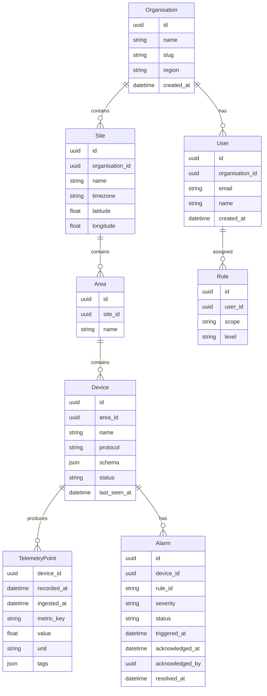
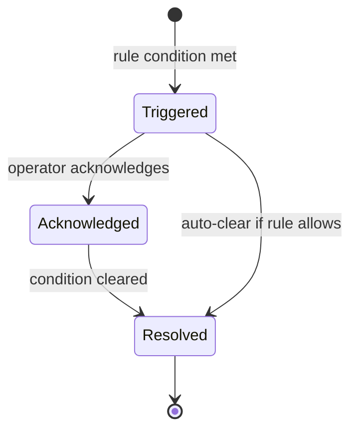

# Data Model

## Design principles

1. **Multi-tenant from day one.** Every record is scoped to an Organisation. There is no shared data space.
2. **Immutable telemetry.** Time-series data is never updated after write. Corrections are new writes with metadata.
3. **Explicit timestamps.** Every record carries both `recorded_at` (device time) and `ingested_at` (platform time).
4. **Schema-on-write.** Device telemetry is validated against a device-level schema at ingestion time.

---

## Entity hierarchy

---

## Telemetry schema

Individual telemetry points are stored in a time-series store. Each point carries:

| Field | Type | Description |
|---|---|---|
| `device_id` | UUID | Foreign key to Device |
| `recorded_at` | ISO 8601 | Timestamp from the device |
| `ingested_at` | ISO 8601 | Timestamp when the platform received it |
| `metric_key` | string | The metric identifier (e.g. `temperature`, `vibration_rms`) |
| `value` | float | Numeric value |
| `unit` | string | SI unit or enumerated unit string |
| `tags` | JSON | Arbitrary key-value metadata (e.g. sensor location, quality flag) |

---

## Alarm states

---

## Multi-tenancy enforcement

- All queries are scoped by `organisation_id` at the Core level
- No query path exists that returns cross-tenant data
- Tenant isolation is enforced by the Core, not by the API layer
- The API layer may further scope by `site_id` or `area_id` based on user role

---

## Data retention (TBD)

Retention policies will be defined per-organisation and per-metric tier. An ADR is required before implementing retention logic. Default retention targets:

| Tier | Resolution | Retention |
|---|---|---|
| Raw | 1s | 30 days |
| Aggregated | 1min | 1 year |
| Historical | 1hr | Indefinite |
