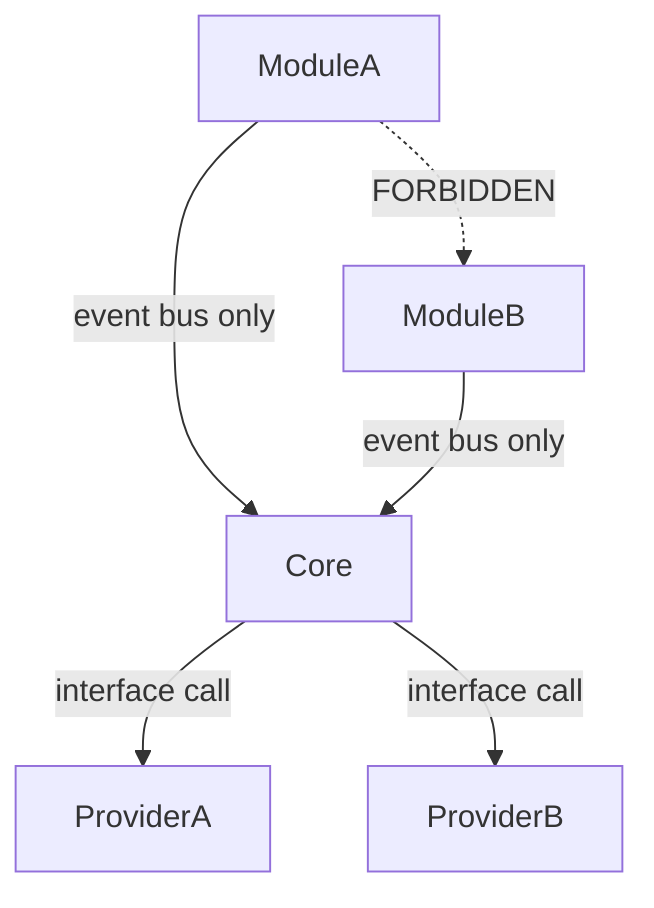

# Modules

## Definition

A Module is a discrete, independently deployable unit of platform capability. Modules are registered with the Core at startup. They consume and produce typed events on the Core event bus. They do not import each other directly.

---

## Module contract

Every module must implement the Module interface:

```
IModule {
  id: string              // unique, stable identifier (e.g. "alarm-manager")
  version: string         // semver
  dependencies: string[]  // list of Core interfaces required
  onStart(): void
  onStop(): void
  onEvent(event: CoreEvent): void
}
```

Modules declare their dependencies at registration. The Core verifies all declared dependencies are satisfied before allowing a module to start.

---

## Module catalogue

### Alarm Manager

| Property | Value |
|---|---|
| Module ID | `alarm-manager` |
| Status | Planned |
| Dependencies | `ITelemetryStore`, `IAlarmStore`, `IMessageBus` |

Evaluates alarm rules against incoming telemetry. Emits `alarm.triggered` events. Supports threshold, rate-of-change, and ML-score alarm types.

---

### Device Manager

| Property | Value |
|---|---|
| Module ID | `device-manager` |
| Status | Planned |
| Dependencies | `IDeviceStore`, `IMessageBus` |

Maintains device registry state. Handles device provisioning, deprovisioning, and configuration. Tracks connection state.

---

### Telemetry Manager

| Property | Value |
|---|---|
| Module ID | `telemetry-manager` |
| Status | Planned |
| Dependencies | `ITelemetryStore`, `IMessageBus` |

Receives normalised telemetry from the Integration Bus. Validates against device schema. Writes to the telemetry store. Emits `telemetry.received` events.

---

### AI Engine

| Property | Value |
|---|---|
| Module ID | `ai-engine` |
| Status | Planned |
| Dependencies | `IAIProvider`, `IMessageBus` |

Subscribes to `telemetry.received` events. Routes data to configured AI models via `IAIProvider`. Emits inference results as typed events.

---

### Integration Bus

| Property | Value |
|---|---|
| Module ID | `integration-bus` |
| Status | Planned |
| Dependencies | `IMessageBus` |

Acts as the normalisation layer between Protocol Providers and the Core. Receives raw telemetry from any protocol provider, maps it to the canonical telemetry schema, and emits `telemetry.raw` events.

---

### Notification Manager

| Property | Value |
|---|---|
| Module ID | `notification-manager` |
| Status | Planned |
| Dependencies | `INotificationProvider`, `IMessageBus` |

Subscribes to `alarm.triggered` events. Routes notifications to configured channels (email, SMS, webhook, push) via `INotificationProvider`.

---

### Organisation Manager

| Property | Value |
|---|---|
| Module ID | `organisation-manager` |
| Status | Planned |
| Dependencies | `IDeviceStore`, `IMessageBus` |

Manages tenant hierarchy: Organisation → Site → Area → Device. Enforces data isolation boundaries at the module level.

---

## Module isolation rules



- Modules **must not** import other modules
- Modules **must not** call provider interfaces directly — only the Core does
- Modules communicate exclusively through the Core event bus
