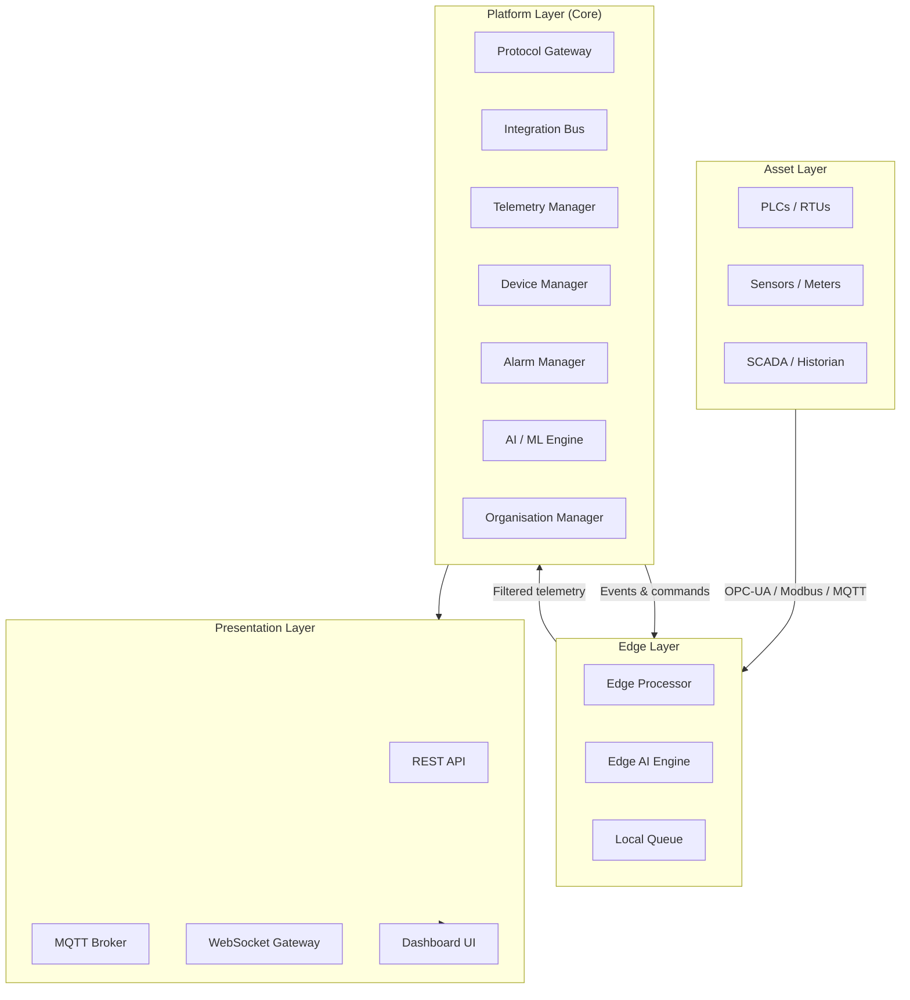
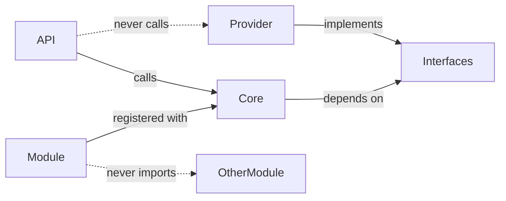

# Architecture Overview

## Platform topology

The LavinIoT platform is organised into four horizontal layers. Each layer has a defined responsibility and communicates with adjacent layers through documented interfaces only.

---

## Layer responsibilities

### Asset Layer
Physical devices and existing control infrastructure. LavinIoT does not control this layer — it reads from it and (where permitted) writes back to it.

### Edge Layer
- **Edge Processor**: Receives raw protocol data, normalises it, applies local filtering rules
- **Edge AI Engine**: Runs inference models locally for time-critical decisions
- **Local Queue**: Buffers data during connectivity loss; synchronises when connection is restored

### Platform Layer (Core)
The Core is the authoritative system of record. It:
- Normalises all incoming telemetry into a canonical data model
- Enforces multi-tenant isolation
- Evaluates alarm conditions
- Stores time-series data
- Orchestrates AI/ML inference (cloud-side)
- Manages device registry and organisation hierarchy

### Presentation Layer
Stateless interface adapters. The REST API, MQTT broker, and WebSocket gateway serve external consumers. The Dashboard UI is one consumer of the REST API — it is not privileged.

---

## Design invariants

These rules must never be violated. If a proposed change would violate one, it requires a superseding ADR first.

| # | Invariant |
|---|---|
| INV-01 | The Core communicates with providers through interfaces only — never directly |
| INV-02 | Tenant data is isolated at the data model level — not the application level |
| INV-03 | The API layer is stateless — all state lives in the Core |
| INV-04 | The Edge module can operate without cloud connectivity |
| INV-05 | All external interfaces are versioned |
| INV-06 | Every write operation is audited |

---

## Module dependency rules

**Modules do not import other modules directly.** All cross-module communication goes through the Core event bus or Core service interfaces.

---

## Technology choices

| Layer | Technology | Rationale |
|---|---|---|
| Platform backend | Python / Flask | ADR-TBD |
| Platform frontend | Next.js (React) | ADR-TBD |
| Time-series storage | TBD | ADR-TBD |
| Message broker | MQTT (Mosquitto / EMQX) | ADR-TBD |
| Edge runtime | TBD | ADR-TBD |
| Infrastructure | VPS + Vercel (hybrid) | ADR-TBD |

Technology choices for TBD items require ADRs before implementation begins.
