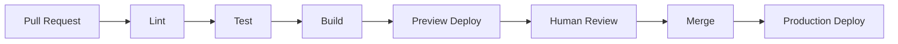

# CI / CD

## Pipeline principles

- Every pull request runs the full test suite before merge
- No code reaches production without passing CI
- Deployments are automated — no manual steps for standard releases
- Rollbacks are automated and tested

## Repository pipeline map

| Repository | CI | Deployment target |
|---|---|---|
| `laviniot-website` | GitHub Actions | Vercel (automatic) |
| `laviniot-platform` | GitHub Actions | Vercel + VPS |
| `laviniot-architecture` | GitHub Actions | TBD (Docusaurus build) |

## Pipeline stages

## Environment promotion

| Environment | Trigger | Purpose |
|---|---|---|
| Preview | Every PR | Visual and functional review |
| Staging | Merge to `main` | Integration testing |
| Production | Manual promotion or tag | Live customer traffic |

:::note Placeholder
GitHub Actions workflow files will be linked here as they are created.
:::
