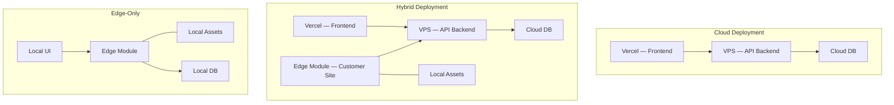

# Deployment Overview

## Deployment models

LavinIoT supports three deployment models to accommodate different customer requirements:

---

## Model selection guide

| Requirement | Recommended model |
|---|---|
| Cloud connectivity always available | Cloud |
| Intermittent connectivity, cloud preferred | Hybrid |
| Air-gapped or strict data residency | Edge-Only |
| Time-critical local decisions + cloud reporting | Hybrid |

---

## Current production topology

| Component | Location | URL |
|---|---|---|
| Marketing website | Vercel | `www.lavin-iot.com` |
| Platform dashboard | Vercel | `app.lavin-iot.com` |
| API backend | VPS (TBD) | `api.lavin-iot.com` |
| MQTT broker | VPS (TBD) | TBD |
| Time-series DB | VPS (TBD) | Internal only |

---

## Sections

- [Cloud](./cloud) — Cloud deployment topology and configuration
- [Edge](./edge) — Edge module deployment and operation
- [Hybrid](./hybrid) — Hybrid configuration and synchronisation
- [CI / CD](./ci-cd) — Build, test, and deployment pipelines
